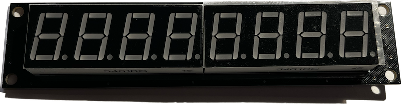

# Library for cheap 74hc595 based 8-digit 7-segment displays



Haven't found much information about these. Some Blog-posts, but not as library. Therefore...

## Usage

Include this library into your IDE (Arduino via library-manager, platformio via `lib_deps`) by pointing to this repository.


```c
#include <Arduino.h>

#include <Display8Digits74595.h>

#define GPIO_PIN_FOR_RCLK 2
#define GPIO_PIN_FOR_SCLK 3

int8_t DIO[] = {
    4,
    5,
    6,
    7,
    8,
    9,
    10,
    11,
};

Display8Digits74595 display(GPIO_PIN_FOR_RCLK, GPIO_PIN_FOR_SCLK, 8, DIO);

void setup()
{
    Serial.begin(115200);
}

void loop()
{

    display.displayLoop();

    while (Serial.available()) {
        static auto currentLine = String("");
        auto s = Serial.read();
        if (s != '\n' && s != '\r') {
            currentLine += (char)s;
        } else {
            // Serial.printf("Parsing %s\n", currentLine.c_str());
            if (currentLine.length() > 2 && currentLine.charAt(1) == '=') {
                auto lineToPrint = currentLine.charAt(0) - '0';
                if (lineToPrint >= 0 && lineToPrint < MAX_Display8Digits74595_DISPLAYS) {
                    display.setDisplayContent(lineToPrint, currentLine.substring(2));
                }
            }
            currentLine = String("");
        }
    }
}

```
